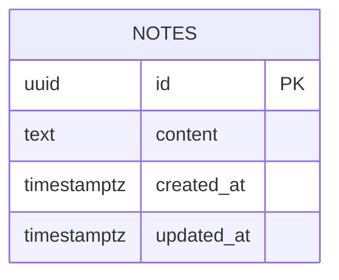

# Database Design (ERD) — Note Board

Engine: PostgreSQL 16
Last updated: 2026-08-13
Source requirements: `docs/notes/SRS.md`

## 1. Overview

This schema stores public saved notes for the single read-only "Note Board" page. `notes` is the only aggregate root because SRS requires one list of saved note content and no users, note details, search, or mutation workflows. Seed/import tooling remains outside product scope; empty table is valid and drives empty state.

## 2. Diagram

Cardinality notation: no relationships exist in this schema. `notes` is standalone because authentication, ownership, comments, tags, attachments, and note detail pages are out of scope.

## 3. Entities

### 3.1 `notes`

**Purpose** — Stores saved note content displayed in the read-only notes list. **Traces to** — NOTES-002, NOTES-003, NOTES-004; data fields `note id`, `note content`, `note created time`, `note updated time`.

| Column | Type | Null | Default | Unique | Description |
|---|---|---|---|---|---|
| `id` | `uuid` | no | `gen_random_uuid()` | PK | Surrogate key and public note identifier for stable rendering |
| `content` | `text` | no | none | no | Required saved note content displayed read-only |
| `created_at` | `timestamptz` | no | `now()` | no | Creation time; may be displayed if frontend chooses to show available metadata |
| `updated_at` | `timestamptz` | no | `now()` | no | Last update time maintained by out-of-scope operator/import process |

**Nullable columns** — none.

**Foreign keys**

| Column | References | On delete | On update | Why |
|---|---|---|---|---|
| none | none | n/a | n/a | No parent entities exist in scope |

**Constraints**

- Primary key: `notes_pkey` on `id` enforces unique saved note identity.
- `ck_notes_content_not_blank`: `CHECK (length(btrim(content)) > 0)` ensures every displayed note has required content; blank content would be indistinguishable from missing content.
- `ck_notes_content_length`: `CHECK (length(content) <= 10000)` sets a pragmatic display ceiling for one-page rendering. ponytail: raise limit or paginate if operators need long-form notes.
- `ck_notes_updated_at_not_before_created_at`: `CHECK (updated_at >= created_at)` keeps timestamps coherent.

**Indexes**

| Name | Columns | Type | Query it serves |
|---|---|---|---|
| `idx_notes_created_at_id` | `created_at DESC, id DESC` | btree | List all saved notes in stable newest-first order for `GET /notes` |

**Lifecycle** — Hard delete only. Product has no delete UI, no audit/report requirements, and no relationships needing tombstones. Operator-side data maintenance outside product may remove rows directly; removed rows disappear from read-only list.

## 4. Enumerations

No enumerations. Notes have no status or type in SRS.

| Name | Values | Mechanism | Why |
|---|---|---|---|
| none | n/a | n/a | No fixed value set exists |

## 5. Access patterns

| # | Pattern | Frequency | Index used |
|---|---|---|---|
| 1 | `SELECT id, content, created_at, updated_at FROM notes ORDER BY created_at DESC, id DESC` for public notes list | Every page load | `idx_notes_created_at_id` |
| 2 | Empty-state detection when list query returns zero rows | Every page load with no notes | Same list query; no separate index needed |

## 6. Data volume and growth

| Table | Rows at launch | Growth | Retention |
|---|---|---|---|
| `notes` | 0+ seeded rows | Operator-dependent; expected small for first version | Until operator removes rows outside product scope |

No table is expected to exceed 10M rows within a year for this first read-only note board. If note count grows enough to hurt page load, add pagination/windowing as new product scope before adding more indexes.

## 7. Integrity, privacy, and security

- Database enforces note identity, required non-blank content, timestamp coherence, and stable ordering support. Application enforces read-only HTTP surface and output escaping because those are request/response concerns.
- Personal data: none required by SRS. `content` may contain user-entered text from outside product scope, so frontend must render as escaped text, not raw HTML.
- Secrets: none.
- Row-level access: none. SRS assumes notes are public to any Visitor. If private notes become required, authentication and ownership tables are new scope.

## 8. Migrations

| # | Change | Forward | Backward | Safe on non-empty table |
|---|---|---|---|---|
| 1 | Initial `notes` schema | `CREATE EXTENSION IF NOT EXISTS pgcrypto; CREATE TABLE notes (...); CREATE INDEX idx_notes_created_at_id ON notes (created_at DESC, id DESC);` | `DROP INDEX IF EXISTS idx_notes_created_at_id; DROP TABLE IF EXISTS notes;` | yes for new empty DB; on populated DB, create table is safe if name unused; dropping table destroys rows and is local rollback only |

Initial forward migration is safe because it only creates new objects. Backward migration is destructive by nature; use only before real saved notes need preservation or after explicit data backup.

## 9. Open questions

None. TL decisions from SRS open defaults: display all rows returned by data source, ordered newest-first by `created_at DESC, id DESC` for stable repeatable list rendering.

| Question | Owner | Blocking |
|---|---|---|
| none | n/a | no |
