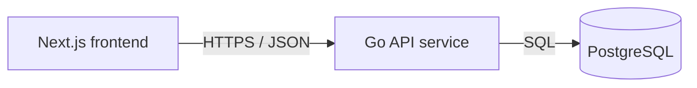

# Service & Interface Design — Note Board

Last updated: 2026-08-13
Source: `docs/notes/SRS.md`, `docs/architecture/erd.md`

## 1. Service map



| Service | Responsibility | Owns (tables) | Depends on | Deploy unit |
|---|---|---|---|---|
| Go API service | Public read-only notes API and database access boundary | `notes` | PostgreSQL | `code/backend` container |
| Next.js frontend | Single Note Board page, loading/empty/error/populated presentation | none | Go API service through `NEXT_PUBLIC_API_URL` | `code/frontend` container |
| PostgreSQL | Durable saved notes storage | physical database only; logical table owner is Go API service | none | database service |

**Why these boundaries** — single backend service: no split justified yet. Frontend and backend are separate deploy units because browser UI and server/database access have different runtime ownership. PostgreSQL is storage, not an application service.

## 2. Cross-cutting contract

### 2.1 Base

- Base URL: `{scheme}://{host}/api/v1`
- Content type: `application/json; charset=utf-8`
- Versioning: URL path major version. A new major version only for breaking changes.
- Trace header: `X-Request-Id` accepted from the caller, generated if absent, echoed on every response and present in every backend log line.

### 2.2 Authentication and authorization

| Aspect | Decision |
|---|---|
| Mechanism | None. Notes are public to any Visitor per SRS assumption. |
| Token lifetime | n/a |
| Refresh | n/a |
| Transport | No `Authorization` header required or used. If supplied, backend ignores it for this endpoint and must not log its value. |
| Roles | Public Visitor only. |
| Enforcement point | HTTP route table exposes only read endpoints; handlers reject unsupported methods with platform 405 outside this API contract. |

### 2.3 Error contract

Every non-2xx JSON API response from `/api/v1/*` has this shape:

```json
{
  "error": {
    "code": "VALIDATION_FAILED",
    "message": "Human-readable summary, safe to show a user.",
    "details": [
      { "field": "limit", "code": "OUT_OF_RANGE", "message": "Must be between 1 and 100." }
    ],
    "request_id": "01HX..."
  }
}
```

Consumers branch on `code`. `message` is display text and may be reworded at any time without notice. `details` is present and may be empty. Error messages never include SQL, stack traces, file paths, internal hostnames, connection strings, or raw note content.

**Error catalog** — full closed set for this project.

| Code | HTTP | Meaning | Retryable |
|---|---|---|---|
| `VALIDATION_FAILED` | 422 | Query parameter or request shape failed validation | no |
| `NOT_FOUND` | 404 | API path does not exist | no |
| `RATE_LIMITED` | 429 | Too many requests; honor `Retry-After` | yes |
| `INTERNAL` | 500 | Unexpected failure; details are logged by `request_id`, not returned | yes |
| `UNAVAILABLE` | 503 | Database unavailable, request timed out, or service shutting down | yes |

No `UNAUTHENTICATED` or `PERMISSION_DENIED` in v1 because no authentication or private resources exist. Adding authentication is new scope and breaking for this endpoint unless done through a new path/version.

### 2.4 Pagination

One scheme for whole project: cursor pagination. First UI may request the maximum page and display all returned notes, but API still uses cursor shape so growth does not force breaking collection response changes.

```http
GET /api/v1/notes?limit=50&cursor=eyJjcmVhdGVkX2F0IjoiMjAyNi0wOC0xM1QxMjozMDo0NVoiLCJpZCI6IjAxOTg5ZGYzLTAwMDAtNzAwMC04MDAwLTAwMDAwMDAwMDAwMCJ9
```

```json
{
  "notes": [
    {
      "id": "01989df3-0000-7000-8000-000000000000",
      "content": "Example saved note",
      "created_at": "2026-08-13T12:30:45Z",
      "updated_at": "2026-08-13T12:30:45Z"
    }
  ],
  "next_cursor": null,
  "has_more": false
}
```

| Aspect | Decision |
|---|---|
| Style | Cursor over `created_at DESC, id DESC` |
| Default limit | 100 |
| Max limit | 100 |
| Default sort | `created_at DESC, id DESC`; stable and unique |
| Cursor format | URL-safe base64 JSON object with `created_at` RFC 3339 UTC and `id` UUID from last returned row |
| Empty list | `notes: []`, `next_cursor: null`, `has_more: false` |

### 2.5 Validation boundary

Validation boundary is Go API HTTP handler layer before any database call. It validates method, path, query parameter names, query parameter types, cursor decode shape, `limit` range, request body absence, and request size. Downstream repository code may trust validated inputs.

Frontend validates nothing security-critical. It may clamp its own requested `limit` to 100 for UX, but backend remains authoritative.

### 2.6 Idempotency

No write endpoints exist. No endpoint accepts `Idempotency-Key`. If a caller sends `Idempotency-Key` to a GET endpoint, backend ignores it and must not vary the response.

## 3. Endpoints

### 3.1 `GET /api/v1/notes`

**Purpose** — Return saved notes for the public read-only Note Board list. **Traces to** — NOTES-001, NOTES-002, NOTES-003, NOTES-004. **Auth** — none; public Visitor.

**Path / query parameters**

| Name | In | Type | Required | Constraints | Description |
|---|---|---|---|---|---|
| `limit` | query | integer | no | `1 <= limit <= 100`; default `100`; reject non-integer, float, zero, negative, or above max | Maximum notes returned. Omitting it does not widen beyond 100. |
| `cursor` | query | string | no | URL-safe base64 JSON cursor issued by previous response; max 512 bytes after URL decoding | Continue after last row from previous page. |

Unknown query parameters are rejected with `VALIDATION_FAILED` so callers do not think unsupported search/filter/sort flags work.

**Request body**

No request body. If a non-empty body is sent, reject with `VALIDATION_FAILED`.

| Field | Type | Required | Constraints | Description |
|---|---|---|---|---|
| none | n/a | n/a | n/a | GET reads only query parameters. |

**Success response** — `200`

```json
{
  "notes": [
    {
      "id": "01989df3-0000-7000-8000-000000000000",
      "content": "Example saved note",
      "created_at": "2026-08-13T12:30:45Z",
      "updated_at": "2026-08-13T12:30:45Z"
    }
  ],
  "next_cursor": null,
  "has_more": false
}
```

| Field | Type | Nullable | Description |
|---|---|---|---|
| `notes` | array of note objects | no | Saved notes in stable newest-first order. Empty array means empty state, not error. |
| `notes[].id` | string UUID | no | Public note identifier for stable rendering. |
| `notes[].content` | string | no | Saved note content. Render as escaped text, never raw HTML. Length is `1..10000` characters from database constraint. |
| `notes[].created_at` | string date-time | no | RFC 3339 UTC creation timestamp. |
| `notes[].updated_at` | string date-time | no | RFC 3339 UTC update timestamp. |
| `next_cursor` | string | yes | Cursor for next page when `has_more` is true; `null` otherwise. |
| `has_more` | boolean | no | True when more notes exist after this response. |

**Errors** — every code this endpoint can return. No others.

| Code | HTTP | Trigger |
|---|---|---|
| `VALIDATION_FAILED` | 422 | Invalid `limit`; malformed, expired-shape, or too-large `cursor`; unknown query parameter; non-empty request body. |
| `RATE_LIMITED` | 429 | Caller exceeds project read limit. Response includes `Retry-After`. |
| `INTERNAL` | 500 | Unexpected application error while building response. |
| `UNAVAILABLE` | 503 | PostgreSQL unavailable, database query timeout, or service draining. |

**Notes** — GET is idempotent and has no side effects. Backend query timeout: 2 seconds. Response ordering is exactly `created_at DESC, id DESC`. Frontend maps pending fetch to loading state, `200` with empty `notes` to empty state, `200` with one or more notes to populated state, and any non-2xx/network failure to error state. Endpoint deliberately has no add, edit, delete, search, auth, or detail behavior.

### 3.2 `GET /healthz`

**Purpose** — Runtime health probe for backend container and database readiness. **Traces to** — architecture runtime contract, not user-facing SRS. **Auth** — none.

**Path / query parameters**

| Name | In | Type | Required | Constraints | Description |
|---|---|---|---|---|---|
| none | n/a | n/a | n/a | n/a | No parameters. |

**Request body**

No request body.

| Field | Type | Required | Constraints | Description |
|---|---|---|---|---|
| none | n/a | n/a | n/a | Health check has no input. |

**Success response** — `200`

```json
{
  "ok": true
}
```

| Field | Type | Nullable | Description |
|---|---|---|---|
| `ok` | boolean | no | True when migrations completed and database `SELECT 1` succeeds. |

**Errors** — every code this endpoint can return. No others.

| Code | HTTP | Trigger |
|---|---|---|
| `UNAVAILABLE` | 503 | Migrations failed, database ping failed, or service is shutting down. |

**Notes** — Not under `/api/v1` because it is operational, not product API. It may use same error shape when returning JSON. It has no database write side effects.

## 4. Asynchronous work

No jobs, queues, schedules, or events exist.

| Name | Trigger | Payload | Retry | Backoff | Dead letter | Idempotent |
|---|---|---|---|---|---|---|
| none | n/a | n/a | n/a | n/a | n/a | n/a |

## 5. External integrations

No third-party integrations exist. Only database dependency is internal infrastructure.

| System | Purpose | Protocol | Timeout | Retry | On failure | Secrets |
|---|---|---|---|---|---|---|
| PostgreSQL | Read saved notes | SQL over driver connection | 2 seconds per notes query; 1 second health ping | No automatic retry inside request; next page load/refresh may try again | Visitor sees error state for notes list; health check returns 503 | `DATABASE_URL` runtime env, listed in `.env.example`; value never committed |

Cross-service calls:

| Caller | Callee | Mode | Timeout | Retry policy | Idempotency key | On failure |
|---|---|---|---|---|---|---|
| Next.js frontend/browser | Go API `GET /api/v1/notes` | synchronous HTTPS JSON | 5 seconds client fetch timeout | No automatic background retry; user refresh or page reload starts new GET | none; GET is idempotent | Notes area shows error state, not stale partial or empty content |
| Go API service | PostgreSQL | synchronous SQL | 2 seconds query timeout | No retry within same request to avoid duplicate DB load during outage | none; read-only query | Return `UNAVAILABLE` 503 with request id; frontend shows error state |

## 6. Non-functional targets

| Aspect | Target |
|---|---|
| p95 latency (read) | `GET /api/v1/notes` <= 500 ms from API to DB and JSON response for up to 100 notes under normal load |
| p95 latency (write) | n/a; no write endpoints |
| Availability | 99.5% target for API process excluding planned deploy downtime |
| Rate limit | 120 `GET /api/v1/notes` requests per source IP per minute; return `RATE_LIMITED` with `Retry-After` when enforced |
| Payload cap | Request body cap 1 KiB for GET endpoints; response target <= 1 MiB for 100 notes at DB content limit ceiling |
| Timeout (inbound) | 10 seconds total HTTP request timeout; 2 seconds DB query timeout inside it |

## 7. Observability

- Log fields on every backend request line: `request_id`, `method`, `path`, `status`, `duration_ms`, `remote_addr`, `user_agent`, `error_code` when present.
- Metrics per endpoint: request count, non-2xx count by error code/status, duration histogram, DB query duration for notes list.
- Never log: secrets, `DATABASE_URL`, authorization headers, cookies, full request bodies, raw note content, stack traces in HTTP responses.

## 8. Contract evolution

| Change | Additive or breaking | Migration path |
|---|---|---|
| Add optional response field to note object | Additive | Frontend ignores unknown fields. |
| Add new collection endpoint under `/api/v1/*` | Additive | No migration needed. |
| Add optional query parameter that preserves default results | Additive | Document default and keep existing behavior when omitted. |
| Require authentication for `GET /api/v1/notes` | Breaking | New major version or new endpoint; keep public v1 until known consumers migrate. |
| Rename response fields or change timestamp format | Breaking | Add new field first, migrate consumers, deprecate old field with header, remove only in new major version. |
| Change default ordering | Breaking | Add explicit optional sort parameter first; keep default stable until new major version. |
| Add create/update/delete/search behavior | Additive only if new endpoints; breaking if added through flags on `GET /api/v1/notes` | Use separate endpoints or new plan item; no boolean behavior switch. |

## 9. Requirement traceability

| SRS requirement | Contract mapping |
|---|---|
| NOTES-001 Show loading state | Frontend pending state while calling `GET /api/v1/notes`; 5 second client timeout bounds wait. |
| NOTES-002 Show populated notes list | `GET /api/v1/notes` returns `200` with `notes[]` containing `id`, `content`, `created_at`, `updated_at` in stable order. |
| NOTES-003 Show empty state | `GET /api/v1/notes` returns `200` with `notes: []`, `has_more: false`, `next_cursor: null`. |
| NOTES-004 Show error state | `GET /api/v1/notes` returns specified non-2xx errors or frontend receives network failure; UI shows error state. |

| Endpoint | Requirement mapping |
|---|---|
| `GET /api/v1/notes` | NOTES-001, NOTES-002, NOTES-003, NOTES-004 |
| `GET /healthz` | Architecture runtime health contract only; not user-facing scope. |

## 10. Open questions

| Question | Owner | Blocking |
|---|---|---|
| none | n/a | no |
